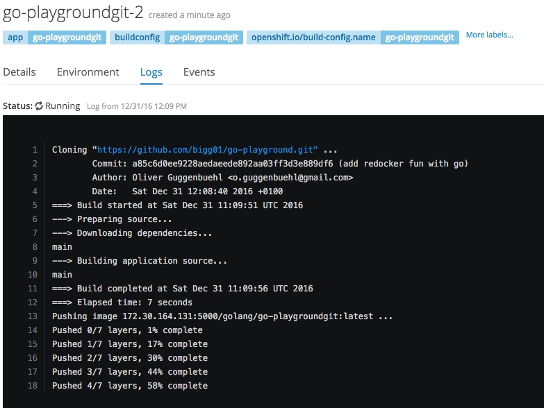
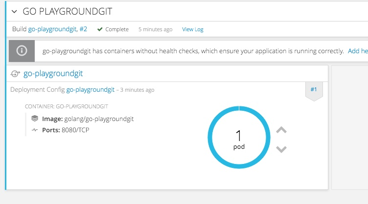

https://hub.docker.com/r/bigg01/go-17-centos7/

https://github.com/bigg01/s2i-go






```

$ git clone https://github.com/bigg01/s2i-go.git
Klone nach 's2i-go' ...
remote: Counting objects: 104, done.
remote: Compressing objects: 100% (3/3), done.
remote: Total 104 (delta 0), reused 0 (delta 0), pack-reused 101
Empfange Objekte: 100% (104/104), 29.05 KiB | 0 bytes/s, Fertig.
Löse Unterschiede auf: 100% (35/35), Fertig.
Prüfe Konnektivität ... Fertig.

$  cd s2i-go/

$ make build VERSION=1.7
SKIP_SQUASH=0 VERSIONS="1.4 1.5 1.6 1.7" OS=centos7 VERSION=1.7 BASE_IMAGE_NAME=go OPENSHIFT_NAMESPACES="1.4 1.5 1.6 1.7" hack/build.sh
-> Building openshift/go-17-centos7 ...
Sending build context to Docker daemon 155.6 kB
Step 1 : FROM openshift/base-centos7
Trying to pull repository docker.io/openshift/base-centos7 ...
latest: Pulling from docker.io/openshift/base-centos7
08d48e6f1cff: Already exists
147e60d42739: Pull complete
71d046d973b9: Pull complete
85dab2e0d129: Pull complete
Digest: sha256:7ec6e9129556a9e4b0c8bbe5e6e1d15dafd751116fb09e0a21ccdb209644495f
Status: Downloaded newer image for docker.io/openshift/base-centos7:latest
 ---> 3640b6a4a916
Step 2 : MAINTAINER SoftwareCollections.org <sclorg@redhat.com>
 ---> Running in 717f8872c7fd
 ---> aaa7015b5c01
Removing intermediate container 717f8872c7fd
Step 3 : EXPOSE 8080
 ---> Running in cd23f5075f98
 ---> 671a6097df3f
Removing intermediate container cd23f5075f98
Step 4 : ENV GO_MINOR_VERSION 7 GO_PATCH_VERSION 3
 ---> Running in 83c81a762cc3
 ---> 21940fe90de3
Removing intermediate container 83c81a762cc3
Step 5 : ENV GO_VERSION 1.${GO_MINOR_VERSION} GOPATH $HOME/go GOBIN $HOME/go/bin SOURCE $HOME/go/src/main PATH $PATH:$HOME/go/bin:/usr/local/go/bin
 ---> Running in d56bd8be9381
 ---> 9c9b34eea2f9
Removing intermediate container d56bd8be9381
Step 6 : LABEL io.k8s.description "Platform for building and running Go applications" io.k8s.display-name "Go ${GO_VERSION}" io.openshift.expose-services "8080:http" io.openshift.tags "builder,go,go1${GO_MINOR_VERSION}"
 ---> Running in d322c6b8edea
 ---> d03ac20a57f6
Removing intermediate container d322c6b8edea
Step 7 : RUN yum install -y centos-release-scl &&     INSTALL_PKGS="mercurial" &&     yum install -y --setopt=tsflags=nodocs --enablerepo=centosplus $INSTALL_PKGS &&     rpm -V $INSTALL_PKGS &&     yum clean all -y &&     (curl -L https://storage.googleapis.com/golang/go${GO_VERSION}${GO_PATCH_VERSION:+.}${GO_PATCH_VERSION}.linux-amd64.tar.gz |         tar -xz -C /usr/local)
 ---> Running in 97e7071b3606
Loaded plugins: fastestmirror, ovl
Determining fastest mirrors
 * base: mirror.switch.ch
 * extras: mirror.switch.ch
 * updates: mirror.switch.ch
Resolving Dependencies
--> Running transaction check
---> Package centos-release-scl.noarch 0:2-2.el7.centos will be installed
--> Processing Dependency: centos-release-scl-rh for package: centos-release-scl-2-2.el7.centos.noarch
--> Running transaction check
---> Package centos-release-scl-rh.noarch 0:2-2.el7.centos will be installed
--> Finished Dependency Resolution

Dependencies Resolved

================================================================================
 Package                    Arch        Version               Repository   Size
================================================================================
Installing:
 centos-release-scl         noarch      2-2.el7.centos        extras       12 k
Installing for dependencies:
 centos-release-scl-rh      noarch      2-2.el7.centos        extras       12 k

Transaction Summary
================================================================================
Install  1 Package (+1 Dependent package)

Total download size: 24 k
Installed size: 39 k
Downloading packages:
--------------------------------------------------------------------------------
Total                                               13 kB/s |  24 kB  00:01
Running transaction check
Running transaction test
Transaction test succeeded
Running transaction
  Installing : centos-release-scl-rh-2-2.el7.centos.noarch                  1/2
  Installing : centos-release-scl-2-2.el7.centos.noarch                     2/2
  Verifying  : centos-release-scl-rh-2-2.el7.centos.noarch                  1/2
  Verifying  : centos-release-scl-2-2.el7.centos.noarch                     2/2

Installed:
  centos-release-scl.noarch 0:2-2.el7.centos

Dependency Installed:
  centos-release-scl-rh.noarch 0:2-2.el7.centos

Complete!
Loaded plugins: fastestmirror, ovl
Loading mirror speeds from cached hostfile
 * base: mirror.switch.ch
 * centosplus: mirror.switch.ch
 * extras: mirror.switch.ch
 * updates: mirror.switch.ch
Resolving Dependencies
--> Running transaction check
---> Package mercurial.x86_64 0:2.6.2-6.el7_2 will be installed
--> Finished Dependency Resolution

Dependencies Resolved

================================================================================
 Package            Arch            Version                 Repository     Size
================================================================================
Installing:
 mercurial          x86_64          2.6.2-6.el7_2           base          2.6 M

Transaction Summary
================================================================================
Install  1 Package

Total download size: 2.6 M
Installed size: 12 M
Downloading packages:
Running transaction check
Running transaction test
Transaction test succeeded
Running transaction
  Installing : mercurial-2.6.2-6.el7_2.x86_64                               1/1
  Verifying  : mercurial-2.6.2-6.el7_2.x86_64                               1/1

Installed:
  mercurial.x86_64 0:2.6.2-6.el7_2

Complete!
Loaded plugins: fastestmirror, ovl
Cleaning repos: base centos-sclo-rh centos-sclo-sclo extras updates
Cleaning up everything
Cleaning up list of fastest mirrors
  % Total    % Received % Xferd  Average Speed   Time    Time     Time  Current
                                 Dload  Upload   Total   Spent    Left  Speed
100 78.7M  100 78.7M    0     0  2435k      0  0:00:33  0:00:33 --:--:-- 2974k
 ---> 4e6d0b54d1d4
Removing intermediate container 97e7071b3606
Step 8 : COPY ./s2i/ $STI_SCRIPTS_PATH
 ---> e6a8f90fca80
Removing intermediate container 4041c129a98a
Step 9 : USER 1001
 ---> Running in 46234f99d01d
 ---> fec2fa961091
Removing intermediate container 46234f99d01d
Step 10 : CMD $STI_SCRIPTS_PATH/usage
 ---> Running in f7c880aef5a0
 ---> d6ab5ad94338
Removing intermediate container f7c880aef5a0
Step 11 : LABEL io.openshift.builder-version "27c69f7f43b84773a81b9ef9d587375684ec92a4"
 ---> Running in 535643a03d84
 ---> 559afeabf1df
Removing intermediate container 535643a03d84
Successfully built 559afeabf1df
zip_safe flag not set; analyzing archive contents...
2016-12-31 11:36:48,961 root         INFO     docker-squash version 1.0.4, Docker e03ddb8/1.10.3, API 1.22...
2016-12-31 11:36:48,961 root         INFO     Using v2 image format
2016-12-31 11:36:49,024 root         INFO     Old image has 25 layers
2016-12-31 11:36:49,026 root         INFO     Checking if squashing is necessary...
2016-12-31 11:36:49,027 root         INFO     Attempting to squash last 10 layers...
2016-12-31 11:36:49,027 root         INFO     Saving image sha256:559afeabf1dfe36d16d9cd8daa07a1f8a00f73c9fb0959936025d4b54e3cefac to /tmp/docker-squash-prDRoi/old/image.tar file...


2016-12-31 11:58:56,327 root         INFO     Image saved!
2016-12-31 11:58:56,933 root         INFO     Unpacking /tmp/docker-squash-prDRoi/old/image.tar tar file to /tmp/docker-squash-prDRoi/old directory
2016-12-31 11:59:40,413 root         INFO     Archive unpacked!
2016-12-31 11:59:42,172 root         INFO     Squashing image 'openshift/go-17-centos7'...
2016-12-31 11:59:42,214 root         INFO     Starting squashing...
2016-12-31 11:59:44,091 root         INFO     Squashing file '/tmp/docker-squash-prDRoi/old/fa2a4ee093b027147be417a24f22ea76dd972f79bca6d5e84948ebb7bc0f830d/layer.tar'...
2016-12-31 11:59:44,092 root         INFO     Squashing file '/tmp/docker-squash-prDRoi/old/aeda5fb43ef224414461f636e80fc5d591bf80f8899c870c85aa1767ffd59f0c/layer.tar'...
2016-12-31 11:59:47,523 root         INFO     Squashing finished!
2016-12-31 11:59:51,413 root         INFO     New squashed image ID is e4462ef66ec0d4007e7d33b403097e992d3763695012ec389b1c0fdeb769f7b8
2016-12-31 12:01:47,791 root         INFO     Done


$  docker images
REPOSITORY                                      TAG                 IMAGE ID            CREATED             SIZE
<none>                                          <none>              e4462ef66ec0        27 minutes ago      660.1 MB
openshift/go-17-centos7                         latest              559afeabf1df        27 minutes ago      660.1 MB
172.30.164.131:5000/metrics/grafana-openshift   latest              eeb81829a434        2 days ago          477.8 MB
docker.io/sonatype/nexus3                       <none>              2a55fb9c4767        11 days ago         486.1 MB
docker.io/centos                                <none>              67591570dd29        2 weeks ago         191.8 MB
docker.bintray.io/jfrog/artifactory-oss         <none>              7e62030682f1        2 weeks ago         448.1 MB
docker.io/openshift/base-centos7                latest              3640b6a4a916        3 weeks ago         384.3 MB
docker.io/sebp/elk                              latest              47752d9139c1        5 weeks ago         969.2 MB
docker.io/openshift/origin-docker-builder       v1.4.0-rc1          cf887e755f9f        5 weeks ago         487.9 MB
docker.io/openshift/origin-deployer             v1.4.0-rc1          97d5d2a1056e        5 weeks ago         487.9 MB
docker.io/openshift/origin-docker-registry      v1.4.0-rc1          c9688f4b9a6d        5 weeks ago         354.1 MB
docker.io/openshift/origin-haproxy-router       v1.4.0-rc1          62d57b8aa2e3        5 weeks ago         507.1 MB
docker.io/openshift/origin                      v1.4.0-rc1          991ede2d2ae4        5 weeks ago         487.9 MB
docker.io/openshift/origin-pod                  v1.4.0-rc1          35c4b9c016c0        5 weeks ago         1.139 MB
quay.io/prometheus/prometheus                   v1.0.1              62b473b89d8d        5 months ago        43.23 MB
docker.io/fabric8/prometheus-kubernetes         2.2.157             641cf4e45b1c        8 months ago        58.46 MB

$ docker tag 559afeabf1df bigg01/go-17-centos7
$ docker push bigg01/go-17-centos7
The push refers to a repository [docker.io/bigg01/go-17-centos7]
efee8d44d9c0: Pushed
0df7173edada: Pushing [======================>                            ] 123.8 MB/275.8 MB
8435a2367216: Mounted from openshift/base-centos7
de493216effd: Mounted from openshift/base-centos7
c425a7d563ee: Mounted from openshift/base-centos7
97ca462ad9ee: Mounted from openshift/origin

```


```
oc new-app bigg01/go-17-centos7~https://github.com/bigg01/go-playground.git  --context-dir=httpd
--> Found Docker image 559afea (31 minutes old) from Docker Hub for "bigg01/go-17-centos7"

    Go 1.7
    ------
    Platform for building and running Go applications

    Tags: builder, go, go17

    * An image stream will be created as "go-17-centos7:latest" that will track the source image
    * A source build using source code from https://github.com/bigg01/go-playground.git%C2%A0 will be created
      * The resulting image will be pushed to image stream "go-playgroundgit:latest"
      * Every time "go-17-centos7:latest" changes a new build will be triggered
    * This image will be deployed in deployment config "go-playgroundgit"
    * Port 8080/tcp will be load balanced by service "go-playgroundgit"
      * Other containers can access this service through the hostname "go-playgroundgit"

--> Creating resources ...
    imagestream "go-17-centos7" created
    imagestream "go-playgroundgit" created
    buildconfig "go-playgroundgit" created
    deploymentconfig "go-playgroundgit" created
    service "go-playgroundgit" created
--> Success
    Build scheduled, use 'oc logs -f bc/go-playgroundgit' to track its progress.
    Run 'oc status' to view your app.
```

```
oc logs -f bc/go-playgroundgit
Cloning "https://github.com/bigg01/go-playground.git" ...
	Commit:	fb0f4d7217e6500eebf16c5dae1bc6273af94601 (adchange main go)
	Author:	Oliver Guggenbuehl <o.guggenbuehl@gmail.com>
	Date:	Sat Dec 31 12:17:17 2016 +0100
===> Build started at Sat Dec 31 11:18:07 UTC 2016
---> Preparing source...
---> Downloading dependencies...
main
---> Building application source...
main
===> Build completed at Sat Dec 31 11:18:11 UTC 2016
===> Elapsed time: 4 seconds
Pushing image 172.30.164.131:5000/golang/go-playgroundgit:latest ...
Pushed 4/7 layers, 57% complete
Pushed 5/7 layers, 71% complete
Pushed 6/7 layers, 86% complete
Pushed 7/7 layers, 100% complete
Push successful```
```
```
